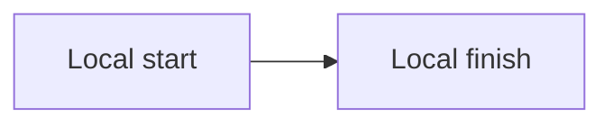
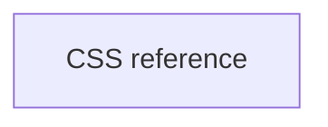

# Diagram requests

```mermaid
flowchart LR
A["Local start"] --> B["Local finish"]
```

```mermaid
flowchart LR
A@{ img: "https://paperforma-audit.invalid/mermaid.png", label: "Permission image", pos: "b", h: 60, constraint: "on" }
```

```mermaid
---
config:
  themeCSS: 'rect { fill: url(https://paperforma-audit.invalid/css-image.svg#paint); }'
---
flowchart LR
A["CSS reference"]
```

END OF DIAGRAM TEST
