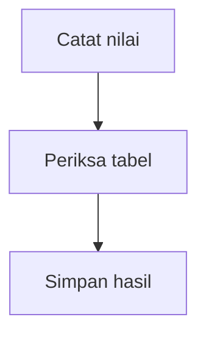

# Pemeriksaan tugas kelas

```mermaid
flowchart TD
  A[Catat nilai] --> B[Periksa tabel]
  B --> C[Simpan hasil]
```

**Gambar referensi**

Contoh sintaks diagram yang perlu dibaca ulang.

```mermaid
diagram-tanpa-jenis
  Nilai belum ditetapkan
```

Catatan penutup tetap terbaca.
